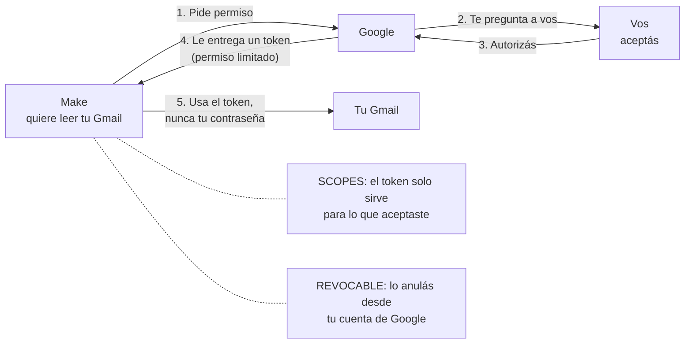

# Guía 2 — Conectar Gmail con OAuth2

## Qué es OAuth2 (en una imagen)

En la Semana 3 conectaste Google Sheets a Make con el botón **"Iniciar sesión con Google"**. Con Gmail es igual. Ese botón es **OAuth2**: la forma de darle permiso a Make para usar tu Gmail **sin entregarle tu contraseña**.

Pensá en el ticket de un estacionamiento con valet: le das al valet **un ticket**, no las llaves de tu casa. El ticket solo sirve para **ese auto** y lo podés anular cuando quieras.

- **Token**: el permiso que recibe Make. No es tu contraseña.
- **Scopes (alcances)**: qué puede hacer ese permiso (leer correos, enviar, etc.). Nada más que eso.
- **Revocable**: lo podés anular desde tu cuenta de Google cuando quieras.

Tiempo estimado: 5 minutos.

---

## Paso a paso

La conexión se crea al agregar el primer módulo de Gmail (Guía 3, Paso 2). Cada pantalla corresponde a un paso del diagrama:

1. En el módulo **Gmail > Watch Emails**, hacé clic en **Create a connection**.
2. **Connection name**: `Gmail Agencia Norte`.
3. Dejá **Advanced settings** apagado. **Additional scopes** también se deja vacío (solo hace falta para otro módulo que no usamos).
4. Hacé clic en **Sign in with Google**. *(Paso 1 del diagrama: Make pide permiso.)*
5. Se abre una ventana de Google: elegí la cuenta que vas a automatizar. *(Paso 2: Google te pregunta a vos.)*
6. Google te muestra **qué permisos pide Make** sobre tu correo. Esos son los **scopes**. Aceptalos. *(Paso 3: autorizás.)*
7. La ventana se cierra sola y la conexión aparece guardada en Make. *(Paso 4: Make ya tiene su token.)*

Si en el módulo podés elegir tus etiquetas de Gmail en el campo **Folder / Label**, la conexión funciona.

---

## Dos cosas para recordar

- **Cada 6 meses hay que renovar el permiso.** Desde junio de 2024, Google limita a 6 meses el acceso de apps como Make a las cuentas @gmail.com personales. Cuando venza, en Make: **Connections** > `Gmail Agencia Norte` > **Reauthorize**.
- **Para quitarle el permiso a Make** (por ejemplo, al terminar el curso): Cuenta de Google > **Seguridad** > **Tus conexiones con apps y servicios de terceros** > `Make` > **Borrar todas las conexiones**. Ese es el "revocable" de OAuth2 en la práctica.

## Si algo falla

| Problema | Qué revisar |
|---|---|
| La ventana de Google no se abre | Tu navegador está bloqueando ventanas emergentes. Permitilas para make.com y volvé a intentar. |
| Elegiste la cuenta equivocada | En Make: **Connections**, borrá esa conexión y creala de nuevo. |
| Aparece "Access blocked" o no te deja conectar | Pasa con algunas cuentas de trabajo o de escuela, que tienen reglas de su administrador. Usá una cuenta @gmail.com personal. Si igual necesitás esa cuenta, Make permite un método alternativo con credenciales propias de Google Cloud: está en la [ayuda oficial de Make](https://apps.make.com/google-email). No hace falta para el curso. |
