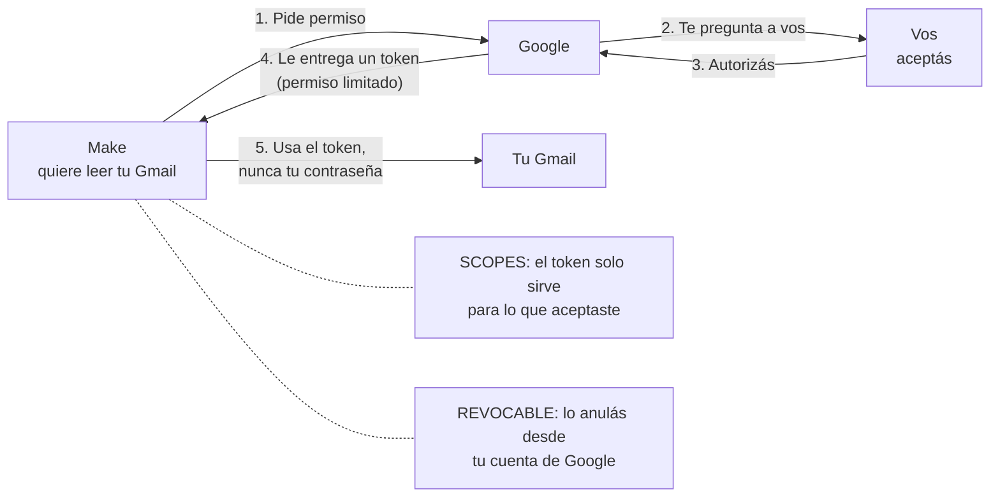

# Guía 2 — Conectar Gmail con OAuth2

## Por qué existe este paso

En la Semana 3 conectaste Google Sheets a Make con un clic ("Iniciar sesión con Google"). Con **Gmail** no alcanza: Google protege mucho más el acceso al correo y **Make no puede conectarse directamente a cuentas personales @gmail.com**.

La solución es que vos mismo registres a Make ante Google como una aplicación autorizada **para tu cuenta**. Eso se hace en Google Cloud Console, creando un **cliente OAuth**. Suena técnico, pero es completar formularios. Y te sirve para entender el concepto de **OAuth2**, que pide la Pre-entrega 5.

### OAuth2 en una imagen

Pensá en el ticket de un estacionamiento con valet: le das al valet **un ticket**, no las llaves de tu casa. El ticket solo sirve para **ese auto**, en **ese lugar**, y lo podés anular cuando quieras.



- **Token**: el permiso que recibe Make. No es tu contraseña.
- **Scopes (alcances)**: qué puede hacer ese permiso (leer correos, enviar, etc.). Nada más que eso.
- **Revocable**: lo podés anular desde tu cuenta de Google cuando quieras.

Tiempo estimado: 20 minutos.

---

## Paso 1 — Crear el proyecto en Google Cloud

1. Entrá a [console.cloud.google.com](https://console.cloud.google.com) con la **misma cuenta de Gmail** que vas a automatizar.
2. Si es tu primera vez, aceptá los términos del servicio.
3. Arriba a la izquierda, hacé clic en el selector de proyectos y después en **Proyecto nuevo** (New project).
4. Nombre: `Make Agencia Norte`. Hacé clic en **Crear**.
5. Cuando termine, **seleccioná ese proyecto** en el selector de arriba. Todo lo que sigue se hace dentro de él.

## Paso 2 — Activar la API de Gmail

1. En el menú de la izquierda: **APIs y servicios** > **Biblioteca** (APIs & Services > Library).
2. Buscá `Gmail API`, entrá y hacé clic en **Habilitar** (Enable).
   (Si en lugar de "Habilitar" dice "Administrar", ya estaba activa.)

## Paso 3 — Configurar la pantalla de consentimiento

Es la pantalla que Google te va a mostrar cuando Make pida permiso.

1. **APIs y servicios** > **Pantalla de consentimiento de OAuth** (OAuth consent screen) > **Comenzar** (Get started).
2. Información de la app:
   - Nombre de la app: `Make`
   - Correo de asistencia: tu Gmail.
3. Público (Audience): elegí **Externo** (External).
4. Información de contacto: tu Gmail.
5. Aceptá la política de datos de Google y hacé clic en **Crear**.
6. En **Desarrollo de la marca** (Branding) > **Dominios autorizados**, agregá dos dominios:
   - `make.com`
   - `integromat.com`
   
   Guardá.
7. En **Público** (Audience) > **Usuarios de prueba** (Test users), agregá **tu propio Gmail**. Guardá.

## Paso 4 — Agregar los permisos (scopes)

1. Entrá a **Acceso a los datos** (Data access) > **Agregar o quitar permisos** (Add or remove scopes).
2. Al final del panel hay un campo para agregar permisos manualmente. Pegá estos cuatro, uno por línea:

```
https://www.googleapis.com/auth/gmail.modify
https://www.googleapis.com/auth/gmail.readonly
https://www.googleapis.com/auth/gmail.compose
https://www.googleapis.com/auth/gmail.send
```

3. Hacé clic en **Agregar a la tabla**, después en **Actualizar** y por último en **Guardar**.

## Paso 5 — Crear el cliente OAuth

1. Entrá a **Clientes** (Clients) > **Crear cliente** (Create client).
2. Tipo de aplicación: **Aplicación web** (Web application).
3. Nombre: `Make`.
4. En **URI de redireccionamiento autorizados** (Authorized redirect URIs), hacé clic en **Agregar URI** y pegá exactamente:

```
https://www.make.com/oauth/cb/google/email
```

5. Hacé clic en **Crear**.
6. Google te muestra el **ID de cliente** (Client ID) y el **Secreto del cliente** (Client secret). Copialos y guardalos junto a tus otras claves.

> IMPORTANTE: el Client secret es una contraseña. Mismo cuidado que con la API key de Groq.

## Paso 6 — Crear la conexión en Make

Esto se hace al agregar el primer módulo de Gmail (Guía 3, Paso 2). Te lo dejamos acá para tenerlo junto:

1. En el módulo de Gmail, hacé clic en **Create a connection**.
2. Nombre de la conexión: `Gmail Agencia Norte`.
3. Activá **Show advanced settings**.
4. Pegá el **Client ID** y el **Client Secret**.
5. Recién ahora hacé clic en **Sign in with Google** y elegí tu cuenta.
6. Google va a mostrar un aviso de que la app no está verificada. Es esperable: la "app" sos vos mismo. Hacé clic en **Continuar**.
7. Marcá todos los permisos que pide y aceptá.

Si volvés a Make y la conexión aparece guardada, está listo.

---

## Checklist

- [ ] Proyecto `Make Agencia Norte` creado y seleccionado.
- [ ] Gmail API habilitada.
- [ ] Pantalla de consentimiento en **Externo**, con `make.com` e `integromat.com` como dominios y mi Gmail como usuario de prueba.
- [ ] Los cuatro scopes de Gmail agregados.
- [ ] Cliente OAuth web con la URI `https://www.make.com/oauth/cb/google/email`.
- [ ] Client ID y Client secret guardados.

## Si algo falla

| Problema | Qué revisar |
|---|---|
| `Error 400: redirect_uri_mismatch` | La URI del Paso 5 tiene que ser idéntica, sin espacios ni barra al final. |
| `Access blocked` o `access_denied` | Faltó agregar tu Gmail como usuario de prueba (Paso 3.7). |
| `Error 403` al usar el módulo | La Gmail API no quedó habilitada (Paso 2), o creaste el cliente en otro proyecto. Revisá el selector de proyecto. |
| La conexión dejó de funcionar a los días | Mientras la app está en modo **Prueba** (Testing), Google puede pedirte que vuelvas a autorizar. En Make: **Connections** > tu conexión de Gmail > **Reauthorize**. |

## Para quitar el permiso cuando termine el curso

Cuenta de Google > **Seguridad** > **Tus conexiones con apps y servicios de terceros** > `Make` > **Borrar todas las conexiones**. Ese es el "revocable" de OAuth2 en la práctica.
