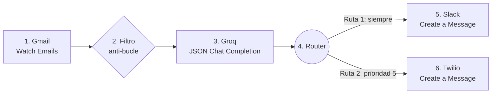

# Guía 3 — Construir el escenario en Make

Vamos a armar, módulo por módulo, el escenario que vimos en clase. La regla es la misma de la Semana 3: **probar después de cada paso**. Si algo falla, sabés exactamente dónde.

Antes de empezar necesitás tener hechas la [Guía 1](./01-preparar-cuentas.md) (Slack, Groq, Twilio) y leída la [Guía 2](./02-conectar-gmail-oauth.md) (qué es OAuth2 y cómo se conecta Gmail).

## El mapa



Lo que ya conocés de la Semana 3: Trigger, Router, Filtros, Error Handler, Run once.
Lo nuevo de hoy: el trigger de Gmail, la IA devolviendo **varios datos**, y las salidas a Slack y WhatsApp.

Tiempo estimado: 45 minutos.

---

## Paso 1 — Preparar tu Gmail para las pruebas

No queremos que la automatización lea **todo** tu correo personal. Vamos a separar las pruebas con una etiqueta.

1. En Gmail, creá una etiqueta: en la barra lateral, **Más** > **Crear etiqueta** > nombre `Agencia Norte`.
2. Creá un filtro: en la barra de búsqueda de Gmail, hacé clic en el ícono de opciones de búsqueda (a la derecha).
   - En **Para**, escribí `tucorreo+norte@gmail.com` (con tu usuario).
   - Hacé clic en **Crear filtro**.
   - Marcá **Aplicar la etiqueta: Agencia Norte** y **Omitir Recibidos (archivarlo)**.
   - **Crear filtro**.
3. Desde otra cuenta, enviá el **Correo 1** de [correos-de-prueba.md](./correos-de-prueba.md) a `tucorreo+norte@gmail.com`. Revisá que llegue con la etiqueta `Agencia Norte`.

## Paso 2 — Trigger: Gmail > Watch Emails

1. En Make: **Scenarios** > **Create a new scenario**.
2. Clic en el **+** grande, buscá **Gmail** y elegí **Watch Emails**.
3. **Connection**: **Create a connection** > nombre `Gmail Agencia Norte` > **Sign in with Google** > elegí tu cuenta y aceptá los permisos (Guía 2).
4. Configuración:
   - **Filter type**: Simple filter.
   - **Folder / Label**: `Agencia Norte`.
   - **Criteria**: Only unread emails.
   - **Mark email message(s) as read when fetched**: Yes. Así no se procesa dos veces el mismo correo.
   - **Maximum number of results**: `1` (para probar de a un correo).
5. Clic en **OK**. Make te pregunta **desde dónde empezar** (Choose where to start): elegí **All** (Todos), para que tome el correo que ya enviaste.
6. Renombrá el módulo: clic derecho > **Rename** > `Consulta entrante`.
7. **Probá**: clic derecho sobre el módulo > **Run this module only**. Abrí la burbuja que aparece encima: tenés que ver el remitente, el asunto y el texto del Correo 1.

## Paso 3 — Filtro anti-bucle

Antes de gastar una consulta de IA, frenamos los correos automáticos ("fuera de la oficina", "no-reply"). Es el **Error 1** del material: dos sistemas respondiéndose sin fin.

1. Agregá el siguiente módulo (en el Paso 4) y después volvé acá: el filtro va en la **línea** entre Gmail y Groq.
2. Clic en la llave inglesa de esa línea > **Set up a filter**.
   - **Label**: `No es respuesta automática`
   - Condición 1: el campo del **correo del remitente** > **Text operators: Does not contain** > `noreply`
   - **Add AND rule**. Condición 2: el mismo campo > **Does not contain** > `no-reply`
   - **Add AND rule**. Condición 3: el **asunto** > **Does not contain (case insensitive)** > `automática`
3. OK.

## Paso 4 — La IA: Groq > Create a JSON Chat Completion

1. Clic en el semicírculo a la derecha de Gmail > buscá **Groq** > **Create a JSON Chat Completion**.
2. **Connection**: **Create a connection** > pegá tu API key de Groq > Save.
3. **Model**: `openai/gpt-oss-20b`. Si no aparece en la lista, elegí `llama-3.3-70b-versatile`.
4. **Messages**: agregá dos mensajes, como en la Semana 3:
   - Mensaje 1, **Role: System**: pegá el texto de [prompt-clasificador.md](./prompt-clasificador.md).
   - Mensaje 2, **Role: User**: el texto con las variables de Gmail (en el mismo archivo).
5. **Max tokens** (si el módulo lo muestra): `500`. Limita el largo de la respuesta y protege tu cuota.
6. OK y renombrá el módulo: `IA: resumen y prioridad`.
7. **Probá**: Run once (abajo a la izquierda). Abrí la burbuja de Groq: en la salida (Output) vas a ver `resumen`, `prioridad` y `telefono` como campos separados. Esa es la ventaja del módulo **JSON**: Make ya "abre la maleta" por vos.

> Si el Run once no trae nada, es porque el correo ya quedó marcado como leído. Marcalo como no leído en Gmail y volvé a probar.

## Paso 5 — Router y Ruta 1: aviso al equipo en Slack

1. A la derecha de Groq: **+** > **Flow Control** > **Router**. Renombralo: `¿Qué canales?`.
2. Primera ruta: agregá **Slack** > **Create a Message**.
3. **Connection**: Create a connection > Make te lleva a Slack > elegí el espacio `Agencia Norte` > **Permitir**.
4. Configuración:
   - **Channel type**: Public channel. **Channel**: `leads`.
   - **Text**: combiná texto fijo con variables:

```
Nueva consulta de [Sender name] ([Sender email address])
Resumen: [resumen]
Prioridad: [prioridad]/5
Ver el correo: https://mail.google.com/mail/u/0/#all/[Thread ID]
```

5. Esta ruta **no lleva filtro**: el equipo se entera de todas las consultas.
6. Renombrá el módulo: `Avisar al equipo`.
7. **Probá**: Run once (con el correo marcado como no leído). Tiene que aparecer el mensaje en `#leads`.

## Paso 6 — Ruta 2: WhatsApp al cliente (solo urgentes)

1. Clic en el Router > agregá una segunda ruta > **Twilio** > **Create a Message**.
2. **Connection**: pegá tu **Account SID** y tu **Auth Token**.
3. Configuración:
   - **From**: `whatsapp:+14155238886` (el número del sandbox, con el prefijo `whatsapp:`).
   - **To**: escribí `whatsapp:` y, pegado, arrastrá la variable `telefono` de Groq. Queda: `whatsapp:[telefono]`.
   - **Body**:

```
Hola [Sender name], te escribimos de Agencia Norte. Recibimos tu consulta sobre "[resumen]". Como es urgente, queremos hablar con vos hoy: respondé este mensaje y te llamamos.
(Mensaje automático)
```

4. Renombrá el módulo: `WhatsApp urgente`.

La línea `(Mensaje automático)` no es un detalle: en la Semana 1 viste que el usuario tiene que saber cuándo interactúa con un sistema automático (transparencia, IA Act).

### El filtro de la Ruta 2

Clic en la llave inglesa de la línea entre el Router y Twilio > **Set up a filter**:

- **Label**: `Urgente con teléfono`
- Condición 1: `prioridad` > **Numeric operators: Equal to** > `5`
- **Add AND rule**. Condición 2: `telefono` > **Text operators: Starts with** > `+`

Dos detalles, los mismos de las Semanas 3 y 4:

- `prioridad` es un **número**: usá un operador **numérico**. Comparar un número con un operador de texto es la trampa de tipos de datos que ya viste.
- La condición del `+` asegura que haya un teléfono en **formato internacional**. Si el correo no traía teléfono, `telefono` viene vacío y la ruta no se activa.

## Paso 7 — Blindaje: Error Handler en la IA

Igual que en la Semana 3, protegemos el módulo más frágil: la llamada a la IA.

1. Clic derecho sobre el módulo de Groq > **Add error handler** > **Break**.
2. **Number of attempts**: `3`. **Interval between attempts**: `1` minuto.
3. Si Make te avisa que hay que permitir guardar ejecuciones incompletas, aceptá (o activalo en **Scenario settings** > **Allow storing of incomplete executions**).

## Paso 8 — La prueba completa

Marcá como no leídos los correos de la etiqueta y enviá los tres de prueba. Cambiá **Maximum number of results** del trigger a `3` y hacé **Run once**:

| Correo | Filtro anti-bucle | Slack | WhatsApp |
|---|---|---|---|
| 1. Urgente | Pasa | Sí | Sí |
| 2. Sin urgencia | Pasa | Sí | No |
| 3. Respuesta automática | Se frena | No | No |

Si cada correo recorrió solo su camino, tu lógica está bien. Esta es la evidencia que vas a capturar para la pre-entrega (Guía 4).

## Paso 9 — Guardar

Clic en el ícono de guardar (abajo). Nombre del escenario: `Agencia Norte - Consultas multicanal`.

---

## Si algo falla

| Síntoma | Causa probable | Qué hacer |
|---|---|---|
| El trigger no trae correos | El correo ya está leído o no tiene la etiqueta | Marcalo como no leído; revisá el filtro de Gmail del Paso 1 |
| Groq da error de autenticación (401) | API key mal copiada | Creá una conexión nueva con la clave completa |
| Groq responde pero sin los tres campos | El prompt del System no se pegó completo | Volvé a pegarlo; tiene que decir "SOLO con un objeto JSON" |
| Slack da `not_in_channel` | La app de Make no está en el canal | En Slack, entrá a `#leads` y escribí `/invite @Make` |
| Twilio da error 21211 (número inválido) | Al número le falta el `+` o tiene espacios | Mirá la salida de Groq: `telefono` tiene que verse como `+5491122334455` |
| Twilio da error 63015 | Ese número no se unió al sandbox | Enviá `join ...` desde ese celular (Guía 1, Parte C) |
| Twilio da error 21606, 21659 o 21910 | Falta el prefijo `whatsapp:` en From o en To | From tiene que ser exactamente `whatsapp:+14155238886` y To tiene que empezar con `whatsapp:` |
| El WhatsApp no llega y no hay error | Pasaron más de 3 días desde tu `join` | Volvé a enviar el `join` al sandbox |
