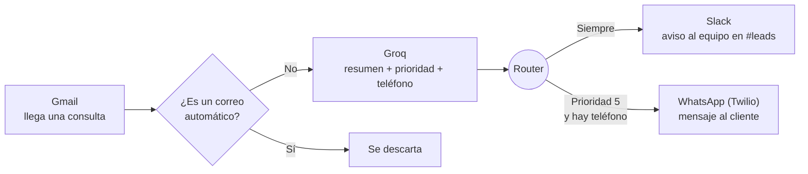

# Semana 5 — Ecosistema de comunicación: Gmail, Slack y WhatsApp API

## Qué construimos en clase

Un escenario en **Make** que atiende las consultas que le llegan por correo a Agencia Norte:

```
Llega un correo  ->  La IA lo lee  ->  Aviso al equipo en Slack (siempre)
   (Gmail)          (Groq: resumen,     +
                     prioridad,         WhatsApp al cliente (solo si es urgente)
                     teléfono)
```



Es la misma forma que el flujo de la Semana 3 (Trigger, IA, Router, dos salidas). Lo nuevo es **por dónde entra** la información (Gmail) y **por dónde sale** (Slack y WhatsApp).

## Por qué volvemos a Make

La Pre-entrega 5 pide el **blueprint de Make**. Make tiene módulos listos para Gmail, Slack y Twilio (WhatsApp), así que conectar los tres canales es más directo que en n8n. No es un retroceso: es elegir la herramienta que mejor resuelve este problema.

## Por qué usamos Groq y no OpenAI

El material menciona OpenAI. En clase usamos **Groq**: se configura en dos minutos, tiene un plan gratuito para practicar y Make tiene un módulo que devuelve la respuesta de la IA ya ordenada en campos. La lógica es exactamente la misma: un modelo de lenguaje que lee el correo y responde con un formato fijo.

## Guías (en este orden)

| # | Guía | Para qué |
|---|---|---|
| 1 | [Preparar las cuentas](./01-preparar-cuentas.md) | Slack, Groq y el sandbox de WhatsApp en Twilio |
| 2 | [Conectar Gmail con OAuth2](./02-conectar-gmail-oauth.md) | Qué pasa cuando hacés clic en "Sign in with Google" |
| 3 | [Construir el escenario](./03-construir-escenario.md) | El flujo completo en Make, módulo por módulo |
| 4 | [Tu Pre-entrega 5](./04-pre-entrega-5.md) | Qué entregar y cómo exportar la evidencia |

Material de apoyo:

- [Correos de prueba](./correos-de-prueba.md): los textos para simular consultas de clientes.
- [Prompt del clasificador](./prompt-clasificador.md): las instrucciones para la IA, listas para copiar.

## Conceptos clave de la clase

| Concepto | En una línea |
|---|---|
| Orquestación multicanal | No es tener muchos canales: es decidir con reglas qué canal entra y cuándo. |
| Matriz de canales | Email para lo formal y documentado, Slack para coordinar al equipo, WhatsApp para lo urgente. |
| API de WhatsApp Business | La "puerta de servicio" que Meta abre para que otros sistemas envíen mensajes. Se usa a través de un proveedor (BSP) como Twilio o Wati. |
| Sandbox | Un entorno de prueba gratuito: como un simulador de vuelo antes de pilotar el avión real. |
| Ventana de 24 horas | Podés escribirle libremente a alguien por WhatsApp durante las 24 horas siguientes a su último mensaje. Después, solo con una plantilla aprobada por Meta. |
| OAuth2 | La forma de darle permiso a Make para usar tu Gmail sin entregarle tu contraseña. |
| Formato internacional | Los números de WhatsApp van con `+`, código de país y sin espacios: `+5491122334455`. |
