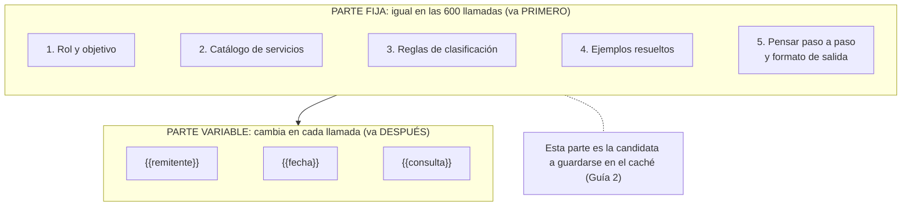

# Guía 1 — La plantilla de prompt

## La idea

En la Semana 5 le pedimos a la IA que leyera **un** correo. Para el reporte mensual, Claude va a leer **600**. Si escribimos el prompt bien, hay una parte que es **idéntica en las 600 llamadas** y otra que cambia en cada una:



El orden importa: **primero todo lo fijo, después todo lo variable**. Si metés una variable en el medio de lo fijo, el caché deja de servir (lo vemos en la Guía 2).

Las variables se escriben entre llaves dobles: `{{consulta}}`. Es la misma idea que las "pastillas" de Make en la Semana 5: un lugar que se llena con un dato distinto cada vez.

---

## La plantilla completa (reporte mensual de Agencia Norte)

### Parte fija

```
Actuá como analista comercial senior de Agencia Norte, una agencia chica de diseño web y marketing digital de Buenos Aires.

Tu objetivo: leer una consulta que un posible cliente envió por correo y clasificarla para el reporte mensual que revisa la directora. El reporte responde tres preguntas: qué servicios pide la gente, con qué presupuesto y con qué urgencia.

CATÁLOGO DE SERVICIOS DE AGENCIA NORTE
- Landing page: desde USD 400. Plazo: 1 semana. Una sola página para una campaña, un lanzamiento o un formulario.
- Sitio web institucional: desde USD 1.200. Plazo: 4 semanas. Varias secciones: inicio, servicios, equipo, contacto.
- Tienda online: desde USD 2.500. Plazo: 6 semanas. Catálogo de productos, carrito y pagos.
- Gestión de redes sociales: USD 300 por mes. Publicaciones, diseño de piezas y respuesta de mensajes.
- Campañas de anuncios: USD 250 por mes más la inversión en pauta. Anuncios en redes y buscadores.

INFORMACIÓN GENERAL DE LA AGENCIA
- Atendemos de lunes a viernes, de 9 a 18 horas (hora de Argentina).
- Trabajamos con clientes de todo el país, de forma remota.
- Forma de pago: 50% al comenzar y 50% al entregar, por transferencia bancaria.
- Todos los proyectos web incluyen dos rondas de cambios y un mes de soporte.
- No hacemos aplicaciones móviles, sistemas a medida ni videojuegos. Si piden algo de esto, el servicio es "Otro".
- Los precios del catálogo son de referencia: el presupuesto final depende del alcance.

CÓMO SUELEN ESCRIBIR LOS CLIENTES
- "Página", "web" o "sitio" puede ser landing o sitio institucional: si habla de una sola página o de una campaña, es Landing page; si menciona varias secciones, es Sitio web institucional.
- "Vender por internet", "carrito", "e-commerce" o "catálogo con pagos" es Tienda online.
- "Instagram", "posteos" o "community manager" es Gestión de redes sociales.
- "Publicidad", "anuncios", "Google Ads" o "pauta" es Campañas de anuncios.
- Si el monto está en pesos, no lo conviertas: usá null en "presupuesto_usd" y mencioná el monto en el resumen.

REGLAS DE CLASIFICACIÓN
1. "servicio": elegí UNO del catálogo. Si pide dos, elegí el principal (el que más presupuesto implica). Si no encaja en ninguno, usá "Otro".
2. "presupuesto_usd": solo si el cliente menciona un monto. Convertí a número entero en dólares (sin símbolos ni puntos). Si no menciona monto, usá null. No lo estimes vos.
3. "prioridad": un número entero del 1 al 5.
   5 = quiere avanzar ya o tiene una fecha límite en los próximos 3 días.
   3 = interés concreto, sin urgencia.
   1 = solo está averiguando, sin fecha ni presupuesto.
4. "resumen": qué necesita, en 10 palabras como máximo.
5. Si la consulta no es de un posible cliente (spam, proveedores, respuestas automáticas), usá servicio "Otro", prioridad 1 y resumen "No es una consulta comercial".

EJEMPLOS RESUELTOS
Consulta: "Necesitamos una landing para el lanzamiento del sábado, tengo presupuesto aprobado. ¿Me llaman hoy?"
Respuesta: {"razonamiento": "Pide una sola página para un lanzamiento con fecha en 3 días.", "servicio": "Landing page", "presupuesto_usd": null, "prioridad": 5, "resumen": "Landing para lanzamiento del sábado, presupuesto aprobado"}

Consulta: "¿Cuánto sale el manejo mensual de redes? Estoy armando el presupuesto del año que viene."
Respuesta: {"razonamiento": "Pregunta precio de redes para el año próximo, sin urgencia ni monto.", "servicio": "Gestión de redes sociales", "presupuesto_usd": null, "prioridad": 1, "resumen": "Averigua precio de redes para el año próximo"}

Consulta: "Queremos vender online nuestros productos. Tenemos unos 3000 dólares. ¿Qué plazos manejan?"
Respuesta: {"razonamiento": "Quiere vender online con monto mencionado de 3000 dólares, sin fecha.", "servicio": "Tienda online", "presupuesto_usd": 3000, "prioridad": 3, "resumen": "Tienda online con presupuesto de 3000 dólares"}

Consulta: "Somos un estudio contable y queremos una web con quiénes somos, servicios y contacto. Nos gustaría tenerla para fin de mes."
Respuesta: {"razonamiento": "Menciona varias secciones y una fecha a fin de mes, sin monto.", "servicio": "Sitio web institucional", "presupuesto_usd": null, "prioridad": 3, "resumen": "Web institucional para estudio contable, a fin de mes"}

Consulta: "Hola, somos proveedores de hosting y queremos ofrecerles un plan especial para agencias."
Respuesta: {"razonamiento": "Es un proveedor ofreciendo un servicio, no un posible cliente.", "servicio": "Otro", "presupuesto_usd": null, "prioridad": 1, "resumen": "No es una consulta comercial"}

CÓMO RESPONDER
Pensá paso a paso antes de dar la conclusión: primero identificá qué pide el cliente, después buscá el servicio en el catálogo, después revisá si menciona monto y fecha, y recién al final decidí la prioridad.
Escribí ese razonamiento en una o dos oraciones dentro del campo "razonamiento", que va primero.
Devolvé exclusivamente un objeto JSON con estas claves, en este orden: "razonamiento", "servicio", "presupuesto_usd", "prioridad", "resumen".
No agregues texto fuera del JSON. No inventes datos que no estén en la consulta.
```

### Parte variable

```
Remitente: {{remitente}}
Fecha: {{fecha}}
Consulta:
{{consulta}}
```

### Qué devuelve (para la consulta de Martina)

```json
{
  "razonamiento": "Pide una landing con fecha límite el sábado y presupuesto aprobado.",
  "servicio": "Landing page",
  "presupuesto_usd": null,
  "prioridad": 5,
  "resumen": "Landing para el sábado, presupuesto aprobado"
}
```

Tres detalles que vienen de semanas anteriores:

- Es la misma **maleta de datos** (JSON) de las Semanas 2, 4 y 5. En un flujo de Make se abriría con Parse JSON, igual que en la Semana 5.
- El **razonamiento va primero** dentro de la maleta. Así cumplimos "pensá paso a paso antes de la conclusión" sin romper el formato: la IA razona y recién después decide.
- Los **ejemplos resueltos** cumplen la misma función que en la Semana 3: le muestran a la IA qué esperamos, y reducen las respuestas inventadas (no las eliminan: siempre hay que revisar).

---

## Probarla (opcional, 10 minutos)

No hace falta para la pre-entrega, pero ver la plantilla funcionando ayuda a entenderla. Podés usar la cuenta de Groq de la Semana 5:

1. Entrá a [console.groq.com](https://console.groq.com) > **Playground**.
2. En el campo **System**, pegá la **parte fija** completa.
3. En el mensaje del usuario, pegá la **parte variable** y reemplazá a mano cada `{{variable}}` con los datos de un correo de prueba (por ejemplo, el de Martina, en [`../semana-05/correos-de-prueba.md`](../semana-05/correos-de-prueba.md)).
4. Enviá. Después cambiá **solo la parte variable** por el correo de Julián y volvé a enviar.

Fijate que la parte fija no se tocó entre una prueba y la otra. Esa es exactamente la parte que, en la API de Claude, se guardaría en el caché.

> Si tenés una cuenta en la consola de Claude con créditos, podés hacer lo mismo en su **Playground**: además de la respuesta, muestra cuántos tokens de entrada y de salida usó cada pedido.

## Para tu pre-entrega

Tu plantilla tiene que tener lo mismo que esta, aplicado a **tu propio caso** (ver Guía 4):

- [ ] Un rol específico y un objetivo detallado.
- [ ] La instrucción de pensar paso a paso antes de la conclusión.
- [ ] Todo lo que cambia en cada ejecución como variable entre `{{ }}`.
- [ ] Todo lo fijo **arriba**, todo lo variable **abajo**.
