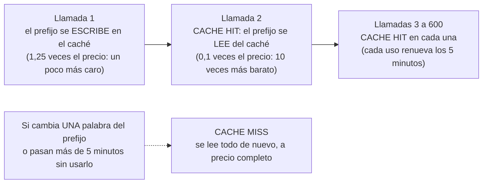
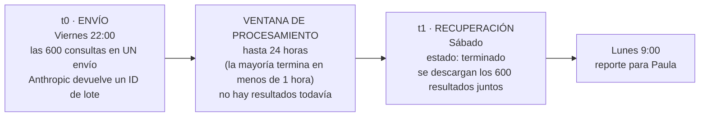
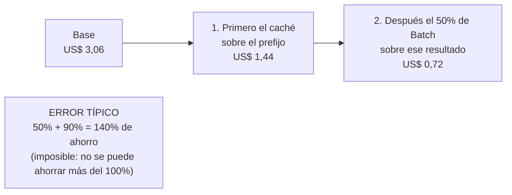

# Guía 2 — Caching y Batch: pagar menos por lo mismo

Seguimos con el reporte mensual de Agencia Norte: **600 consultas**, cada una con la plantilla de la Guía 1.

## Primero: qué se paga

Como viste en la Semana 2 con la analogía del Uber, la IA cobra por **tokens** (pedazos de palabras). En cada llamada se pagan dos cosas:

- **Entrada**: todo lo que le mandás (la parte fija + la parte variable).
- **Salida**: lo que te responde (el JSON).

Con **Claude Sonnet 5**, la entrada cuesta US$ 2 por millón de tokens y la salida US$ 10 por millón. Para nuestro caso:

| | Tokens por consulta | x 600 consultas | Costo |
|---|---:|---:|---:|
| Parte fija (prefijo) | 1.500 | 900.000 | US$ 1,80 |
| Parte variable | 300 | 180.000 | US$ 0,36 |
| Salida | 150 | 90.000 | US$ 0,90 |
| **Total sin optimizar** | | | **US$ 3,06** |

Mirá la primera fila: **más de la mitad del costo es la parte fija**, que es idéntica en las 600 llamadas. Estamos pagando 600 veces por leer el mismo catálogo. Ahí entra el caché.

> Los tokens de cada parte son estimados. El número exacto lo muestra el Playground de la consola de Claude después de cada pedido.

---

## Prompt Caching: no pagar dos veces por leer lo mismo



Cómo funciona:

1. **El prefijo**: es la parte fija, al **principio** del prompt. Claude guarda "desde el principio hasta donde le marcás" (en la API se marca con `cache_control`).
2. **Escritura (primera vez)**: cuesta **1,25 veces** el precio normal de entrada.
3. **Lectura (las siguientes)**: cuesta **0,1 veces** el precio de entrada. Es decir, **90% menos**.
4. **Dura 5 minutos** y cada uso lo renueva gratis. También existe una opción de **1 hora** (la escritura cuesta 2 veces la entrada).
5. **Tiene un mínimo**: si el prefijo es muy corto, no se guarda (y no da error). El mínimo depende del modelo: **1.024 tokens en Sonnet 5**, 4.096 en Haiku 4.5, 512 en Opus 5.

Con nuestras 600 consultas seguidas:

| Prefijo | Cuenta | Costo |
|---|---|---:|
| Sin caché | 600 x 1.500 tokens a US$ 2 por millón | US$ 1,80 |
| Con caché | 1 escritura (1.500 a US$ 2,50) + 599 lecturas (898.500 a US$ 0,20) | US$ 0,18 |
| **Ahorro sobre el prefijo** | | **90%** |

El costo total baja de **US$ 3,06 a US$ 1,44** (52,8% menos). No baja 90% porque la parte variable y la salida se siguen pagando igual: el caché solo abarata lo que se repite.

### La regla de oro: el orden

```
[ PARTE FIJA: rol, catálogo, reglas, ejemplos ]   <- se cachea
[ PARTE VARIABLE: {{remitente}}, {{consulta}} ]    <- cambia siempre
```

Si metés `{{consulta}}` en el medio de las reglas, todo lo que viene después de esa variable ya no es idéntico entre llamadas, y el caché no lo puede reutilizar.

---

## Message Batches: si podés esperar, pagás la mitad

Paula necesita el reporte el **lunes**. No hace falta que la IA responda en segundos. La **Message Batches API** permite mandar las 600 solicitudes **en un solo envío** y retirar los resultados después.



- **Descuento**: 50% sobre la entrada y la salida.
- **Tiempo**: hasta 24 horas. Si no termina en 24 horas, lo pendiente vence.
- **Resultados**: quedan disponibles 29 días.
- **Por qué nuestro caso tolera la espera**: el reporte se revisa el lunes y las consultas se procesan el viernes a la noche. Nadie espera la respuesta en pantalla.

**Cuándo NO usar Batch**: cuando alguien espera la respuesta. El flujo de la Semana 5 (Martina esperando un WhatsApp) no puede ir en lote.

Solo con Batch: **US$ 3,06 pasa a US$ 1,53**.

> En n8n, un lote se arma con las piezas de la Semana 4: un trigger programado (viernes 22:00), un nodo **HTTP Request** que envía el lote a la API de Claude, y otro que después pregunta si terminó y descarga los resultados.

---

## Los dos juntos: se multiplican, no se suman



| Escenario | Total | Ahorro |
|---|---:|---:|
| Base, sin optimizar | US$ 3,06 | 0% |
| Solo Batch | US$ 1,53 | 50,0% |
| Solo Caching (5 minutos) | US$ 1,44 | 52,8% |
| **Caching (1 hora) + Batch** | **US$ 0,72** | **76,4%** |

Dos aclaraciones:

- En un lote, usamos el **caché de 1 hora**: el lote puede tardar más de 5 minutos y así el prefijo sigue guardado. Aun así, dentro de un lote los aciertos de caché no están garantizados: el costo real queda entre US$ 0,72 y US$ 1,53.
- Lo que baja es el **costo por token**, no la **cantidad** de tokens. Las 600 consultas siguen teniendo los mismos tokens.

La [calculadora](./03-calculadora-de-costos.md) hace todas estas cuentas por vos.

---

## Precios oficiales (verificados el 28/09/2026)

US$ por millón de tokens. Fuente: [platform.claude.com/docs/en/about-claude/pricing](https://platform.claude.com/docs/en/about-claude/pricing). Confirmalos antes de entregar: los precios cambian.

| Modelo | Entrada | Salida | Escritura caché 5 min | Lectura caché | Batch entrada / salida | Mínimo cacheable |
|---|---:|---:|---:|---:|---:|---:|
| Claude Haiku 4.5 | 1 | 5 | 1,25 | 0,10 | 0,50 / 2,50 | 4.096 |
| Claude Sonnet 5 | 2 | 10 | 2,50 | 0,20 | 1 / 5 | 1.024 |
| Claude Opus 5 | 5 | 25 | 6,25 | 0,50 | 2,50 / 12,50 | 512 |
