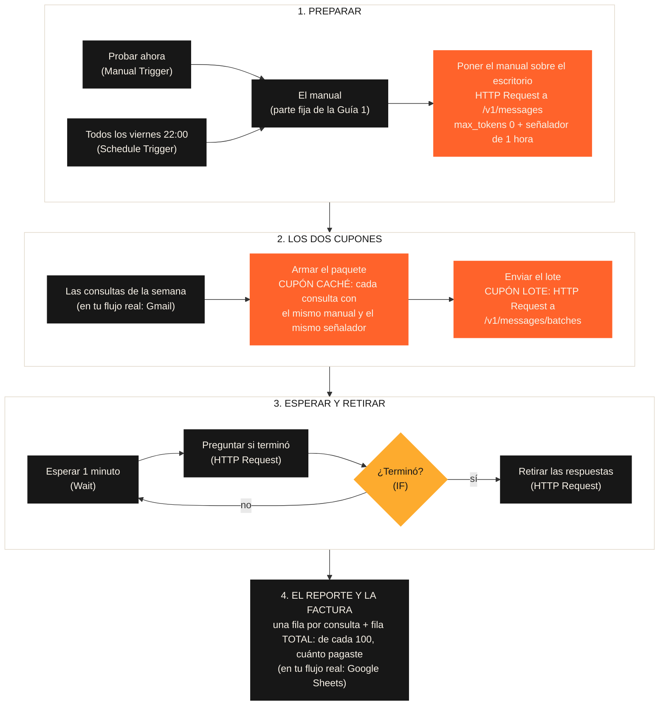

# Guía 5 (opcional) — Los dos cupones, aplicados en tu automatización

> **Opcional.** No se entrega ni suma a la nota: la Pre-entrega 6 es solo el PDF. Esta guía responde la pregunta práctica: **¿qué configuro en mi flujo para pagar menos?**

## La respuesta corta

Ejecutar el flujo una vez por semana **no alcanza**. Ninguno de los dos cupones es automático, y los nodos de Anthropic que trae n8n no aplican ninguno: mandan cada consulta a precio completo aunque el flujo corra una sola vez por semana.

Los cupones se piden en **cómo le hablás a la API**, con un nodo HTTP Request (el de la Semana 4). Son tres cosas:

| Qué configurás | Dónde | Qué cupón da |
|---|---|---|
| **1. El señalador** en cada consulta: `cache_control` al final del manual, con el manual igual y primero en todas | El cuerpo de cada pedido | Cupón caché: el manual se lee 10 veces más barato |
| **2. La dirección del lote**: todas las consultas juntas, en un paquete, a `/v1/messages/batches` en lugar de `/v1/messages` | La URL del HTTP Request | Cupón lote: todo a mitad de precio |
| **3. Esperar y retirar**: el lote no responde en el momento, así que el flujo espera, pregunta si terminó y descarga las respuestas | Nodos Wait, HTTP Request e IF | Ninguno: es lo que el lote exige a cambio |

Y una recomendación de la documentación de Claude: antes del lote, **poner el manual sobre el escritorio** con una llamada chica (`max_tokens: 0`). Dentro de un lote las consultas se procesan al mismo tiempo, y sin esto muchas no encuentran el manual abierto.

La ejecución semanal (Schedule Trigger) solo decide **cuándo** corre el flujo. No cambia el precio.

## El flujo, de punta a punta

Es el reporte de Agencia Norte con los dos cupones, en una sola ejecución:



En naranja, lo que configurás para los cupones. Todo lo demás es un flujo como los de la Semana 4. En el lienzo, cada tramo tiene una nota que lo explica, y los nodos Code traen comentarios.

## Qué necesitás

- Una cuenta de **n8n Cloud** (la prueba gratuita dura 14 días; si la tuya venció, podés leer el flujo igual).
- Saldo en la consola de Claude: [platform.claude.com](https://platform.claude.com) > **Billing**. La API se paga aparte de la suscripción a Claude. Cada prueba de este flujo cuesta alrededor de un centavo de dólar.

## Paso 1 · Importar el flujo

1. En n8n: **Create** (arriba a la izquierda) > **Workflow**.
2. Tres puntos (arriba a la derecha) > **Import from URL** y pegá:

```
https://raw.githubusercontent.com/leanaraque/ai-automation-estudiantes/main/semana-06/n8n/el-reporte-con-los-dos-cupones.json
```

   Si preferís el archivo: abrí [`n8n/el-reporte-con-los-dos-cupones.json`](./n8n/el-reporte-con-los-dos-cupones.json) > **Download raw file** > en n8n, tres puntos > **Import from File**.

## Paso 2 · Conectar tu clave de la API

1. Creá la clave en [platform.claude.com/settings/keys](https://platform.claude.com/settings/keys) > **Create key**. **Elegí un workspace** (por ejemplo, Default): una clave sin workspace no funciona en n8n. Copiala: empieza con `sk-ant-` y se muestra **una sola vez**.
2. En n8n, doble clic en **Poner el manual sobre el escritorio** > **Credential for Anthropic** > **Create new credential** > pegá la clave en **API Key** > **Save**. n8n la prueba al guardarla: si da error, la clave está mal copiada.
3. En los otros tres nodos HTTP Request (**Enviar el lote**, **Preguntar si terminó** y **Retirar las respuestas**), elegí esa misma credencial en **Credential for Anthropic**.

n8n guarda los cambios solo, mientras editás.

**Si al guardar la credencial aparece "Couldn't connect with these settings - Bad Request":** la clave no tiene workspace. Creá otra eligiendo un workspace. O, con la misma clave, activá **Add Custom Header** en la credencial: **Header Name** `anthropic-workspace-id` y **Header Value** el ID de tu workspace (empieza con `wrkspc_`; está en [platform.claude.com/settings/workspaces](https://platform.claude.com/settings/workspaces)).

> La clave es como la tarjeta de crédito de la API: va solo en la credencial, nunca en un nodo ni en el chat.

## Paso 3 · Probarlo

1. Clic en **Execute workflow** (abajo, al centro). El flujo arranca por **Probar ahora**.
2. Esperá. Con 3 consultas, el lote suele terminar en pocos minutos: vas a ver que el nodo **Esperar 1 minuto** se repite hasta que **¿Terminó?** sale por "sí".
3. Doble clic en **El reporte y la factura** > vista **Table**.

Lo que tenés que ver:

| consulta | servicio | prioridad | escritorio |
|---|---|---:|---|
| Martina Sosa | Landing page | 5 | Leyó el manual del escritorio (cupón caché) |
| Julián Pereyra | Gestión de redes sociales | 1 | Leyó el manual del escritorio (cupón caché) |
| Rodrigo Díaz | Campañas de anuncios | 3 | Leyó el manual del escritorio (cupón caché) |
| TOTAL (3 consultas) | | | |

Las filas pueden venir en otro orden: el lote devuelve las respuestas mezcladas y el flujo las ubica por su etiqueta (`custom_id`). Si alguna dice "Guardó el manual otra vez", esa consulta no encontró el manual abierto: dentro de un lote el caché no está garantizado.

En la fila **TOTAL**, mirá la columna **en_palabras**. Dice algo así:

> Con 3 consultas pagaste 66 de cada 100. Con 600 pagarías unos 18: poner el manual sobre el escritorio se paga una sola vez y se reparte entre todas.

Es el ticket de 100 de la clase. Con pocas consultas, poner el manual sobre el escritorio pesa mucho. Con las 600 del mes, ese costo se reparte y el ticket baja a unos 17 o 18: los dos cupones juntos.

## Paso 4 · Dejarlo andando solo

1. Reemplazá **Las consultas de la semana** por un nodo **Gmail** > **Get many messages** con los correos del período, seguido de un **Edit Fields** que deje tres campos con estos nombres: `remitente`, `fecha` y `consulta` (el nodo **Armar el paquete** los usa así). Agregá al final un **Google Sheets** > **Append row** para el reporte de Paula.
2. Revisá el día y la hora en **Todos los viernes 22:00**.
3. Arriba a la derecha, **Publish**. Desde ese momento corre solo en el horario del Schedule Trigger.

Lo que va a hacer cada viernes a las 22:00, sin que toques nada: poner el manual sobre el escritorio, mandar el paquete con los dos cupones, esperar, retirar y dejar el reporte listo para el lunes.
