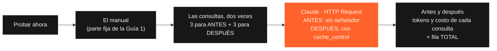
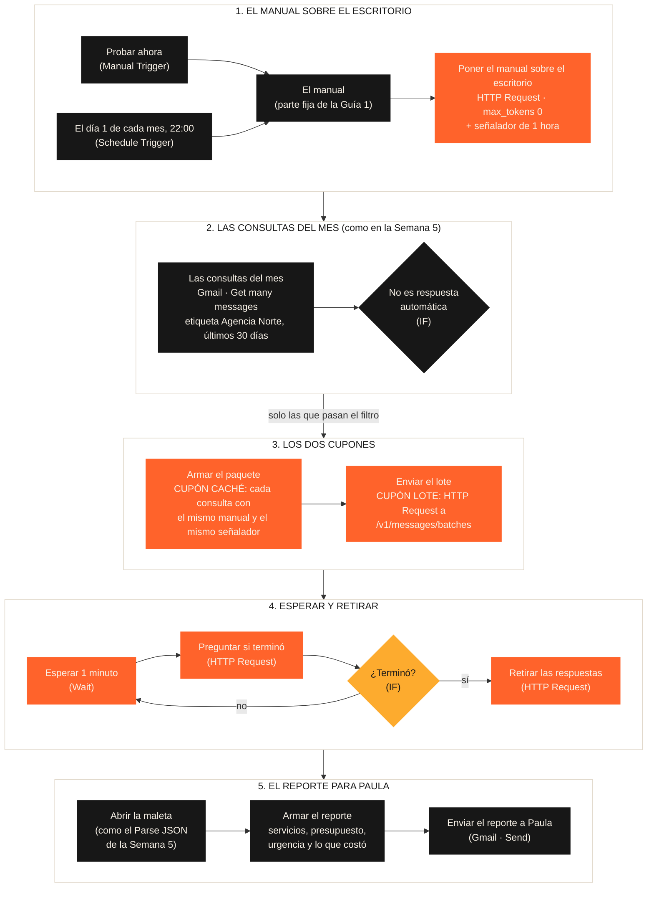

# Guía 5 (opcional) — El caché y el lote, funcionando en n8n

> **Opcional.** No se entrega ni suma a la nota: la Pre-entrega 6 es solo el PDF. Esta guía muestra con la API de Claude de verdad lo que diseñamos en clase.

Tiene dos partes:

| Parte | Qué ves | Cuánto tarda |
|---|---|---|
| **1. Antes y después del caché** | Los tokens de las mismas consultas sin el señalador y con el señalador | Menos de un minuto |
| **2. El reporte mensual para Paula** | El problema de la clase como flujo real: Gmail, los dos cupones y el reporte por correo | Varios minutos (el lote hace esperar) |

El caché no hace esperar: funciona con la API normal, que responde en segundos. El que hace esperar es el lote.

## Antes de empezar

- Una cuenta de **n8n Cloud** (la prueba gratuita dura 14 días).
- Saldo en la consola de Claude: [platform.claude.com](https://platform.claude.com) > **Billing**. La API se paga aparte de la suscripción a Claude. Cada prueba cuesta alrededor de un centavo de dólar.
- **Una clave de la API:** en [platform.claude.com/settings/keys](https://platform.claude.com/settings/keys) > **Create key**. **Elegí un workspace** (por ejemplo, Default): una clave sin workspace no funciona en n8n. Copiala: empieza con `sk-ant-` y se muestra **una sola vez**.

> La clave es como la tarjeta de crédito de la API: va solo en la credencial de n8n, nunca en un nodo ni en el chat.

Para importar cada flujo: en n8n, **Create** (arriba a la izquierda) > **Workflow** > tres puntos (arriba a la derecha) > **Import from URL** > pegá la dirección. Si preferís el archivo: abrilo en la carpeta [`n8n/`](./n8n) > **Download raw file** > en n8n, tres puntos > **Import from File**.

---

# Parte 1 · Antes y después del caché

Las mismas 3 consultas (Martina, Julián y Rodrigo), dos veces:

- **Antes:** sin señalador. Cada consulta paga el manual completo.
- **Después:** con señalador (`cache_control`). La primera deja el manual sobre el escritorio; las otras lo leen 10 veces más barato.

Entre las dos rondas **lo único que cambia es el señalador**. El manual, las consultas y el modelo son los mismos.



## Paso 1 · Importar y conectar

1. Importá esta dirección:

```
https://raw.githubusercontent.com/leanaraque/ai-automation-estudiantes/main/semana-06/n8n/antes-y-despues-del-cache.json
```

2. Doble clic en el nodo **Claude** > **Credential for Anthropic** > **Create new credential** > pegá tu clave en **API Key** > **Save**. n8n la prueba al guardarla.

**Si al guardar aparece "Couldn't connect with these settings - Bad Request":** la clave no tiene workspace. Creá otra eligiendo un workspace. O, con la misma clave, activá **Add Custom Header** en la credencial: **Header Name** `anthropic-workspace-id` y **Header Value** el ID de tu workspace (empieza con `wrkspc_`; está en [platform.claude.com/settings/workspaces](https://platform.claude.com/settings/workspaces)).

## Paso 2 · Ejecutar y comparar

1. Clic en **Execute workflow** (abajo, al centro). Tarda menos de un minuto: las 6 consultas salen de a una, cada 2 segundos.
2. Doble clic en **Antes y después** > vista **Table**.

Lo que tenés que ver (los números exactos pueden variar un poco):

| consulta | antes | despues |
|---|---|---|
| Martina Sosa | 2.473 a precio completo | 212 a precio completo + 2.261 GUARDADOS en el escritorio (un poco más caros) |
| Julián Pereyra | 2.403 a precio completo | 142 a precio completo + 2.261 LEÍDOS del escritorio (10 veces más baratos) |
| Rodrigo Díaz | unos 2.410 a precio completo | unos 150 a precio completo + 2.261 LEÍDOS del escritorio (10 veces más baratos) |

Los números de **antes** son los mismos que viste en el Playground en clase.

Y en la fila **TOTAL**, la columna **en_palabras**:

> Con 3 consultas, de cada 100 que pagabas antes, ahora pagás 62. Con 600 consultas pagarías unos 34: el cupón caché del ticket de 100.

## Cómo leerlo

- **Martina paga un poco más después que antes.** Es la primera: guarda el manual en el escritorio, y guardar cuesta 1,25 veces el precio normal.
- **Julián y Rodrigo pagan unas tres veces menos.** El manual ya estaba abierto: lo leen al 10% del precio.
- **Con 3 consultas el ahorro se ve chico** porque la primera, la más cara, pesa mucho. Con 600, se guarda una sola vez y las otras 599 lo leen: el ticket baja de 100 a 34, como en la clase.

**Probá:**

- **Ejecutalo otra vez enseguida.** En la ronda "después", las tres consultas leen del escritorio: el manual sigue guardado (dura 5 minutos y cada uso lo renueva).
- **Cambiá una sola palabra del manual** (nodo **El manual**) y ejecutalo. Martina vuelve a guardar: para Claude es otro manual. Por eso la parte fija va primero y no cambia nunca.

---

# Parte 2 · El reporte mensual para Paula

## Por qué es un flujo nuevo y no el de la Semana 5

La pregunta de la clase decide: **¿alguien espera la respuesta?**

| | Flujo de la Semana 5 | Este flujo |
|---|---|---|
| Qué hace | Atiende cada consulta cuando llega | Lee todas las consultas del mes juntas |
| ¿Alguien espera? | Sí: Martina espera el WhatsApp | No: Paula lee el reporte el lunes |
| Cupón lote | No se puede: el lote tarda | Sí: la mitad de precio |
| Cupón caché | No aplica: el prompt es corto (menos de 1.024 tokens) | Sí: el manual tiene unos 2.260 tokens |

Los dos flujos conviven: el de la Semana 5 sigue avisando en el momento, y este arma el reporte una vez por mes.

## Qué configurás para pagar menos

Ningún cupón es automático. Ejecutar el flujo una vez por mes no alcanza, y los nodos de Anthropic que trae n8n no aplican ninguno. Los cupones se piden con un nodo **HTTP Request** (el de la Semana 4):

| Qué configurás | Qué cupón da |
|---|---|
| **El señalador:** `cache_control` al final del manual, en cada consulta, con el manual igual y primero | Cupón caché: el manual se lee 10 veces más barato |
| **La dirección del lote:** todas las consultas en un paquete, a `/v1/messages/batches` en lugar de `/v1/messages` | Cupón lote: todo a mitad de precio |
| **Esperar y retirar:** el flujo espera, pregunta si el lote terminó y descarga las respuestas | Ninguno: es lo que el lote pide a cambio |
| **Poner el manual sobre el escritorio** antes del lote: una llamada chica (`max_tokens: 0`) | Ayuda a que el cupón caché funcione dentro del lote (lo recomienda la documentación de Claude) |

## El flujo



En negro, piezas que ya conocés. En naranja, las nuevas. En el lienzo de n8n cada tramo tiene una nota que lo explica, y los nodos Code traen comentarios.

## Qué necesitás

Además de lo de "Antes de empezar": tu Gmail con la etiqueta **Agencia Norte** y los [correos de prueba de la Semana 5](../semana-05/correos-de-prueba.md). El flujo busca los de los últimos 30 días; si son más viejos, reenviátelos y ponelos en la etiqueta.

## Paso 1 · Importar el flujo

```
https://raw.githubusercontent.com/leanaraque/ai-automation-estudiantes/main/semana-06/n8n/el-reporte-mensual-para-paula.json
```

## Paso 2 · Conectar las credenciales

**Claude (4 nodos HTTP Request):** en **Poner el manual sobre el escritorio**, **Enviar el lote**, **Preguntar si terminó** y **Retirar las respuestas**, elegí en **Credential for Anthropic** la credencial que creaste en la Parte 1.

**Gmail (2 nodos):**

1. Doble clic en **Las consultas del mes** > en la credencial, **Create new credential** > **Sign in with Google** > elegí tu cuenta y aceptá los permisos.
2. En **Enviar el reporte a Paula**, elegí esa misma credencial y en **To** cambiá `tu.correo@ejemplo.com` por tu correo.

Si tu etiqueta no se llama "Agencia Norte", cambiá la búsqueda en **Las consultas del mes** > **Filters** > **Search**: `label:agencia-norte` (en Gmail, los espacios de la etiqueta se escriben con guion).

n8n guarda los cambios solo, mientras editás.

## Paso 3 · Probarlo

1. Clic en **Execute workflow** (abajo, al centro). El flujo arranca por **Probar ahora**.
2. Esperá. **Es normal que tarde varios minutos, aunque sean pocas consultas:** el lote entra en una fila con los de todos los clientes (el límite es 24 horas; casi siempre, menos de 1). Mientras tanto, **Esperar 1 minuto** se repite. Para ver que avanza, abrí **Preguntar si terminó**: `processing_status: in_progress` y `errored: 0` significan que está todo bien.
3. Cuando termina, te llega un correo como este:

```
Hola Paula, este es el reporte de las consultas del último mes.

Consultas analizadas: 2

QUÉ SERVICIOS PIDEN
- Landing page: 1
- Gestión de redes sociales: 1

CON QUÉ PRESUPUESTO
- Mencionan un monto: 0 de 2 (en total, USD 0)

CON QUÉ URGENCIA
- Quieren avanzar ya (prioridad 5): 1
- Interés concreto, sin apuro (3 o 4): 0
- Solo averiguan (1 o 2): 1

LAS MÁS URGENTES
- Martina Sosa <martina.sosa@ejemplo.com>: Landing para lanzamiento del sábado, presupuesto aprobado

LO QUE COSTÓ ESTE REPORTE (Claude Sonnet 5, con caché y lote)
- Sin cupones: US$ 0,0125. Con los dos cupones: US$ 0,0112.
- De cada 100, pagamos 90. Con 600 consultas pagaríamos unos 18.

(Reporte automático)
```

La respuesta automática (el correo 3 de la Semana 5) no aparece: la frenó el filtro, igual que en la Semana 5. Los montos exactos van a variar un poco.

## Cómo leer la factura

Mirá las dos últimas líneas del correo: son el ticket de 100 de la clase.

- **Con pocas consultas**, el ahorro se ve chico. Poner el manual sobre el escritorio se paga completo, y con 2 o 3 consultas pesa mucho en el total.
- **Con las 600 del mes**, ese costo se reparte entre todas y el ticket baja a unos 17 o 18: los dos cupones juntos, como en la matriz de tu pre-entrega (de US$ 3,74 a US$ 0,65).

Si querés ver consulta por consulta si encontró el manual abierto, abrí el nodo **Abrir la maleta**: en `factura`, `cache_read_input_tokens` son los tokens leídos del escritorio. Dentro de un lote, el caché no está garantizado; alguna consulta puede no encontrarlo.

## Paso 4 · Dejarlo andando solo

1. Revisá la fecha en **El día 1 de cada mes, 22:00**. Si tu caso es semanal, cambiá el Schedule Trigger a semanas y la búsqueda de Gmail a `newer_than:7d`.
2. Arriba a la derecha, **Publish**. Desde ese momento corre solo.

Lo que hace cada mes, sin que toques nada: pone el manual sobre el escritorio, trae las consultas del mes, manda el paquete con los dos cupones, espera, retira las respuestas y le manda el reporte a Paula.
