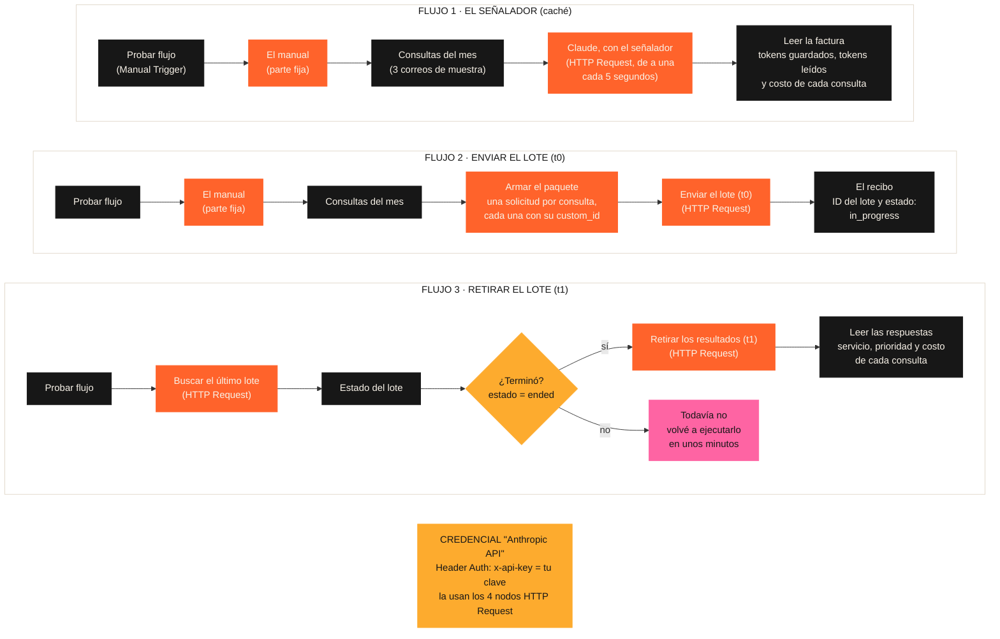

# Guía 5 (bonus) — El señalador y el lote, funcionando en n8n

Esta guía es **opcional**: no suma a la pre-entrega, que es un PDF. Sirve para ver funcionando lo que en clase explicamos con el manual sobre el escritorio y con el envío común: tres flujos chicos de n8n que llaman a la API de Claude con las consultas de Agencia Norte.

## Qué vas a ver

| Flujo | Qué hace | La idea de la clase |
|---|---|---|
| 1 · El señalador | Manda 3 consultas, de a una, con la marca `cache_control` al final de la parte fija | El manual queda sobre el escritorio: la primera consulta lo **guarda**, las siguientes lo **leen** 10 veces más barato |
| 2 · Enviar el lote | Arma un paquete con las 3 consultas y lo manda a la Message Batches API | El **envío** (t0): te devuelven un recibo, todavía sin respuestas |
| 3 · Retirar el lote | Pregunta si el lote terminó y, si terminó, descarga las respuestas | El **retiro** (t1): las respuestas llegan juntas y a mitad de precio |

Casi todos los nodos ya los viste en la Semana 4: el disparador manual, **Edit Fields**, **HTTP Request** e **IF**. Lo nuevo es el nodo **Code**: unas pocas líneas que arman el paquete y leen la factura. No hace falta entenderlas una por una; cada nodo Code trae comentarios que explican qué hace. Y lo nuevo es también a quién le hablamos: directamente a la API de Claude.

## Antes de empezar

| Qué necesitás | Dónde | Nota |
|---|---|---|
| Una cuenta de n8n Cloud | [n8n.io](https://n8n.io) | La prueba gratuita dura 14 días. Si la tuya ya venció, esta guía igual te sirve para leer qué hace cada nodo. |
| Saldo en la consola de Claude | [platform.claude.com](https://platform.claude.com) > **Billing** | La API se paga aparte de la suscripción a Claude. Todo este bonus cuesta menos de US$ 0,05. |
| Una clave de la API de Claude | [platform.claude.com/settings/keys](https://platform.claude.com/settings/keys) | Ver el paso 1. |

## Paso 1 · Crear tu clave de la API

1. Entrá a [platform.claude.com/settings/keys](https://platform.claude.com/settings/keys) (**Settings** > **API keys**).
2. Hacé clic en **Create key**, poné un nombre (por ejemplo `n8n curso`) y confirmá.
3. Copiá la clave: empieza con `sk-ant-`. **Se muestra una sola vez.** Si la perdés, creá otra.

> Tu clave es como la tarjeta de crédito de la API: no la pegues en el chat, ni en un nodo Code, ni en un archivo que compartas. En n8n va solo en una **credencial** (paso 3), que queda guardada aparte del flujo.

## Paso 2 · Importar los tres flujos

Los flujos están en la carpeta [`n8n/`](./n8n) de esta semana. Para cada uno:

1. En n8n, creá un flujo nuevo: botón **Create** (arriba a la izquierda) > **Workflow**.
2. Arriba a la derecha, los **tres puntos** > **Import from URL** y pegá la dirección del archivo:

| Flujo | Dirección para importar |
|---|---|
| 1 | `https://raw.githubusercontent.com/leanaraque/ai-automation-estudiantes/main/semana-06/n8n/1-el-senalador-cache.json` |
| 2 | `https://raw.githubusercontent.com/leanaraque/ai-automation-estudiantes/main/semana-06/n8n/2-enviar-el-lote.json` |
| 3 | `https://raw.githubusercontent.com/leanaraque/ai-automation-estudiantes/main/semana-06/n8n/3-retirar-el-lote.json` |

   Si prefierís el archivo: abrilo en GitHub > **Download raw file** > en n8n, los tres puntos > **Import from File**.

3. Guardá el flujo (**Save** o `Ctrl + S`).

## Paso 3 · Conectar tu clave (una sola vez)

1. En el **flujo 1**, abrí el nodo **Claude, con el señalador** (doble clic).
2. Ya viene configurado: **Authentication** = *Generic Credential Type* y **Generic Auth Type** = *Header Auth*. Falta la credencial.
3. En **Credential for Header Auth**, elegí **Create new credential** y completá:

| Campo | Valor |
|---|---|
| Name | `x-api-key` |
| Value | tu clave (`sk-ant-...`) |

4. Arriba del cuadro, hacé clic en el nombre de la credencial y cambialo a `Anthropic API`. **Save**.
5. En los otros nodos HTTP Request (**Enviar el lote (t0)** en el flujo 2; **Buscar el último lote** y **Retirar los resultados (t1)** en el flujo 3), abrí el nodo y en **Credential for Header Auth** elegí `Anthropic API`, que ya existe. Guardá cada flujo.

La otra cabecera, `anthropic-version: 2023-06-01`, ya viene cargada en cada nodo: la API de Claude la pide siempre.

## Paso 4 · Flujo 1: ver el señalador en acción

1. Abrí el flujo 1 y hacé clic en **Execute workflow** (abajo, en el centro). Tarda unos 15 segundos: las consultas salen de a una, cada 5 segundos, para que la primera deje el manual sobre el escritorio antes de que llegue la segunda.
2. Abrí el nodo **Leer la factura** y mirá la salida en vista de tabla (**Table**).

Lo que tenés que ver (los números exactos pueden variar un poco):

| consulta | tokens_guardados_en_el_escritorio | tokens_leidos_del_escritorio | Qué pasó |
|---|---:|---:|---|
| Martina | unos 2.260 | 0 | Leyó el manual y lo **dejó sobre el escritorio** (escritura: esta vez cuesta un poco más) |
| Julián | 0 | unos 2.260 | El manual **ya estaba abierto**: lo leyó 10 veces más barato |
| Rodrigo | 0 | unos 2.260 | Igual que Julián |

Mirá también la columna **costo_usd**: la de Martina es la más cara; las otras dos cuestan alrededor de un tercio de lo que costarían sin el escritorio. Es el cupón del caché del ticket de 100.

**Probá romperlo** (así se entiende la regla del orden):

- **Ejecutalo de nuevo enseguida.** Ahora las tres filas dicen *leídos*: el manual siguió sobre el escritorio (dura 5 minutos y cada uso lo renueva).
- **Esperá más de 5 minutos** y ejecutalo otra vez: la primera fila vuelve a *guardar*. Pasaron los 5 minutos sin usarlo y el manual se sacó del escritorio.
- **Cambiá una sola palabra del manual** (nodo **El manual (parte fija)**) y ejecutalo: la primera fila vuelve a *guardar*. Para Claude es otro manual. Por eso la parte fija no cambia nunca y va siempre primero.

> Si alguna consulta devuelve error, abrí el nodo **Claude, con el señalador** y leé el mensaje. `authentication_error` es la clave mal copiada; `credit balance is too low` es que falta saldo en la consola.

## Paso 5 · Flujo 2: enviar el lote (t0)

1. Abrí el flujo 2 y hacé clic en **Execute workflow**.
2. Abrí el nodo **El recibo**. Vas a ver el **id_del_lote** (empieza con `msgbatch_`), el **estado** `in_progress` y la hora del envío.

Eso es el **envío** del paquete: todavía no hay respuestas. En el nodo **Armar el paquete** podés ver cómo va cada solicitud: su `custom_id` (`consulta-1`, `consulta-2`, `consulta-3`) y el manual con el señalador de **1 hora** (`"ttl": "1h"`), porque un lote puede tardar más de 5 minutos.

> Si después de enviar el lote volvés al flujo 1, puede que la primera fila ya diga *leídos*: el lote dejó el manual sobre el escritorio por 1 hora.

## Paso 6 · Flujo 3: retirar el lote (t1)

1. Esperá unos minutos (con 3 consultas suele tardar poco; el límite es 24 horas).
2. Abrí el flujo 3 y hacé clic en **Execute workflow**.
3. Si termina en el nodo **Todavía no**: el lote sigue en proceso. Volvé a ejecutarlo en unos minutos.
4. Si termina en **Leer las respuestas**: ahí están las 3 respuestas.

Fijate en tres cosas:

- **El orden.** Las respuestas pueden llegar mezcladas (`consulta-2` antes que `consulta-1`). Por eso cada solicitud lleva su `custom_id`: es la etiqueta del paquete.
- **El costo.** La columna **costo_usd** usa el precio del lote: la mitad. Es el cupón del lote.
- **El escritorio.** Algunas filas pueden decir *leídos* y otras *guardados*: dentro de un lote, los aciertos del caché no están garantizados. Por eso en la Pieza 4 el costo real queda entre el de "solo Batch" y el de "Caching + Batch".

## De 3 consultas a las 600 del mes

Para Paula no alcanza con 3 correos de muestra. En un flujo real cambiarían dos piezas, con nodos que ya viste:

| Hoy (bonus) | En el flujo real |
|---|---|
| **Probar flujo** (lo ejecutás a mano) | **Schedule Trigger**: viernes 22:00, la hora del envío de la Pieza 2 |
| **Consultas del mes** (3 correos escritos en un Code) | **Gmail** > *Get many messages* con los correos del mes |
| Flujo 3 ejecutado a mano | Otro **Schedule Trigger** el sábado, y el resultado a una planilla para el reporte del lunes |

El paquete, el señalador y el retiro quedan exactamente iguales.

## Qué mirar en cada nodo

| Nodo | Dónde está la idea de la clase |
|---|---|
| **El manual (parte fija)** | El prompt de la [Guía 1](./01-la-plantilla-de-prompt.md), sin variables: el prefijo |
| **Claude, con el señalador** | En **JSON**: `system` (el manual), `cache_control` (el señalador) y `messages` (el correo del día). Es el mismo bloque de la Pieza 3 de tu PDF. En **Options** > **Batching**: 1 consulta cada 5000 ms |
| **Leer la factura** | Los campos `cache_creation_input_tokens` (guardados) y `cache_read_input_tokens` (leídos) que devuelve Claude en `usage` |
| **Armar el paquete** | La lista `requests` de la Message Batches API: una solicitud por consulta, con su `custom_id` |
| **¿Terminó?** | El mismo **IF** de la Semana 4: compara el estado con `ended` |
