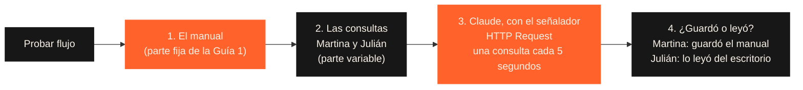

# Guía 5 (opcional) — El señalador, funcionando en n8n

> **Opcional.** No se entrega ni suma a la nota: la Pre-entrega 6 es solo el PDF. Esta guía es para quien quiera ver el caché funcionando con la API de Claude, en la misma herramienta de la Semana 4.

En clase lo explicamos con el manual sobre el escritorio: la primera consulta **deja el manual abierto** y las siguientes **lo leen 10 veces más barato**. Este flujo lo muestra con dos consultas reales: la de Martina y la de Julián.



El flujo trae **notas en el lienzo** que explican cada paso, y los nodos Code tienen comentarios que explican qué hace cada parte.

## Qué necesitás

- Una cuenta de **n8n Cloud** (la prueba gratuita dura 14 días; si la tuya venció, podés leer el flujo igual).
- Saldo en la consola de Claude: [platform.claude.com](https://platform.claude.com) > **Billing**. La API se paga aparte de la suscripción a Claude; cada ejecución de este flujo cuesta alrededor de un centavo de dólar.

## Paso 1 · Importar el flujo

1. En n8n: **Create** (arriba a la izquierda) > **Workflow**.
2. Tres puntos (arriba a la derecha) > **Import from URL** y pegá:

```
https://raw.githubusercontent.com/leanaraque/ai-automation-estudiantes/main/semana-06/n8n/el-senalador-cache.json
```

   Si preferís el archivo: abrí [`n8n/el-senalador-cache.json`](./n8n/el-senalador-cache.json) > **Download raw file** > en n8n, tres puntos > **Import from File**.

## Paso 2 · Conectar tu clave de la API

1. Creá la clave en [platform.claude.com/settings/keys](https://platform.claude.com/settings/keys) > **Create key**. Copiala: empieza con `sk-ant-` y se muestra **una sola vez**.
2. En n8n, doble clic en el nodo **3. Claude, con el señalador**.
3. En **Credential for Anthropic** > **Create new credential** > pegá la clave en **API Key** > **Save**. n8n la prueba al guardarla: si aparece un error, la clave está mal copiada.
4. Guardá el flujo (`Ctrl + S`).

> La clave es como la tarjeta de crédito de la API: va solo en la credencial, nunca en un nodo ni en el chat.

## Paso 3 · Ejecutar y leer el resultado

1. Clic en **Execute workflow** (abajo, al centro). Tarda unos 10 segundos.
2. Doble clic en el nodo **4. ¿Guardó o leyó?** > vista **Table**.

Lo que tenés que ver (los números pueden variar un poco):

| consulta | que_paso | tokens_guardados_en_el_escritorio | tokens_leidos_del_escritorio |
|---|---|---:|---:|
| Martina Sosa | Dejó el manual sobre el escritorio | unos 2.260 | 0 |
| Julián Pereyra | Encontró el manual abierto | 0 | unos 2.260 |

Es el cupón del caché del ticket de 100: el manual se paga completo una vez y después se lee a una décima parte del precio.

## Para probar (opcional)

- **Ejecutalo otra vez enseguida:** las dos filas dicen "encontró el manual abierto". El manual sigue sobre el escritorio (dura 5 minutos y cada uso lo renueva).
- **Cambiá una palabra del manual** (nodo 1) y ejecutalo: Martina vuelve a "dejó el manual". Para Claude es otro manual. Por eso la parte fija va primero y no cambia nunca.
