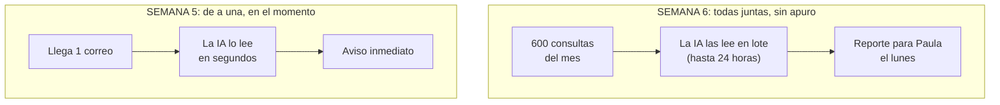

# Semana 6 — Inteligencia de negocio con la API de Claude

## El problema de esta semana

En la Semana 5, Agencia Norte empezó a atender cada consulta **en el momento**: llega un correo, la IA lo lee y avisa. Ahora aparece un pedido distinto. Paula, la directora, quiere un **reporte mensual**: qué servicios pide la gente, con qué presupuesto y con qué urgencia, sobre **las 600 consultas del mes**.

No es urgente (lo necesita el lunes) y es mucho volumen. La pregunta de la clase es: **¿cómo hacemos que la IA lea 600 consultas gastando lo menos posible?**

## Las tres ideas de la clase

1. **La plantilla de prompt**: separar lo que **no cambia** (rol, catálogo de servicios, reglas, ejemplos) de lo que **cambia** en cada consulta (el correo).
2. **Prompt Caching**: la parte que no cambia se guarda en la memoria rápida de Claude y, a partir de la segunda vez, cuesta **10 veces menos**.
3. **Message Batches**: si podés esperar (hasta 24 horas), mandás todo junto y pagás **la mitad**.

Las dos rebajas se pueden combinar, pero **no se suman**: se aplican una sobre la otra. La forma más fácil de verlo es el **ticket de 100** del principio de la Guía 2: sin descuentos 100, con caché 34, con lote 50, con los dos 17.

## Guías (en este orden)

| # | Guía | Para qué |
|---|---|---|
| 1 | [La plantilla de prompt](./01-la-plantilla-de-prompt.md) | El prompt del reporte mensual, con su parte fija y su parte variable, y cómo probarlo |
| 2 | [Caching y Batch](./02-caching-y-batch.md) | Cómo funciona cada descuento, con los precios oficiales y las cuentas hechas |
| 3 | [La calculadora de costos](./03-calculadora-de-costos.md) | Una planilla que hace las cuentas por vos: la usás para tu pre-entrega |
| 4 | [Tu Pre-entrega 6](./04-pre-entrega-6.md) | Las cuatro piezas del PDF, con el ejemplo de Agencia Norte resuelto |
| 5 | [Opcional: los dos cupones en n8n](./05-bonus-n8n.md) | No se entrega. Qué configurar en tu automatización para pagar menos, con un flujo semanal listo para importar |

Archivos de apoyo: [`calculadora-costos-claude.xlsx`](./calculadora-costos-claude.xlsx) y la carpeta [`n8n/`](./n8n) con el flujo opcional de la Guía 5.

## Conceptos clave

| Concepto | En una línea |
|---|---|
| Token | Un pedazo de palabra. Es la unidad con la que se paga: lo que le mandás a la IA (entrada) y lo que te responde (salida). |
| Ventana de contexto | La "mesa de trabajo" de la IA: cuánto texto puede tener delante a la vez. En los modelos actuales de Claude, entre 200.000 y 1.000.000 de tokens. |
| Plantilla de prompt | Un prompt reutilizable: texto fijo más variables entre `{{ }}` que cambian en cada uso. |
| Prefijo | La parte fija que va **al principio** del prompt. Es la que se puede cachear. |
| Prompt Caching | Guardar el prefijo en una memoria rápida. La primera vez cuesta un poco más (escritura); las siguientes, 10 veces menos (lectura). |
| Cache hit / cache miss | Acierto: Claude encontró el prefijo guardado. Fallo: no estaba (o cambió una sola palabra) y lo lee completo. |
| TTL | Cuánto dura el caché: 5 minutos (se renueva con cada uso) o 1 hora. |
| Message Batches | Mandar muchas solicitudes juntas. Se procesan en hasta 24 horas y cuestan la mitad. |
| MCP | Un estándar para conectar la IA con herramientas y datos (Gmail, Notion, Sheets): "el USB-C de la IA". |
